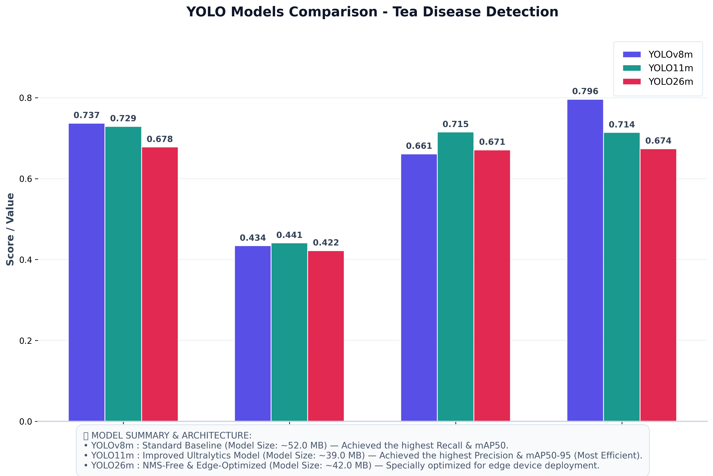

# 🍵 YOLO Tea Disease Detection

Multi-model benchmark comparing YOLOv8, YOLO11, and YOLO26 for tea leaf disease detection.

## 📊 Model Performance Comparison



### 📈 Evaluation Metrics

| Metric | YOLOv8m | YOLO11m | YOLO26m |
|--------|---------|---------|---------|
| **mAP50** | **0.737** | 0.729 | 0.678 |
| **mAP50-95** | 0.434 | **0.441** | 0.422 |
| **Precision** | 0.661 | **0.715** | 0.671 |
| **Recall** | **0.796** | 0.714 | 0.674 |
| **Model Size** | ~52.0 MB | **~39.0 MB** | ~42.0 MB |

### 🔍 Key Findings:
* **YOLOv8m** achieves the **highest Recall (0.796)** and **mAP50 (0.737)**, making it highly sensitive for detecting tea leaf diseases with minimal false negatives.
* **YOLO11m** delivers the **highest Precision (0.715)** and **mAP50-95 (0.441)** with the **smallest model size (~39.0 MB)**, providing cleaner detections with superior memory efficiency.
* **YOLO26m** (NMS-Free & Edge-Optimized) performs slightly below YOLO11m but is optimized for fast real-time inference on low-power edge devices without NMS bottleneck.

---

## 🦠 Detected Disease Classes

The model detects **9 tea leaf disease classes**:

1. `algal_spot` — Algal Spot
2. `brown_blight` — Brown Blight
3. `gray_blight` — Gray Blight
4. `healthy` — Healthy Leaf
5. `helopeltis` — Helopeltis Pest
6. `red-rust` — Red Rust
7. `red-spider-infested` — Red Spider Mite Infestation
8. `red_spot` — Red Spot
9. `white-spot` — White Spot

---

## 📁 Project Structure

```
├── 01_yolo8_kaggle_training/       # YOLOv8 Kaggle workflow
├── 02_yolo11_kaggle_training/      # YOLO11 Kaggle workflow
├── 03_multi_yolo_benchmark/        # Multi-model benchmark
├── 04_outputs/                     # Training outputs & metrics
│   ├── yolo8_v10/                  # YOLOv8 results
│   ├── yolo11_latest/              # YOLO11 results
│   ├── yolo26_latest/              # YOLO26 results
│   └── model_comparison_matrix.png # Comparison visualization
├── 07_tools/                       # Local testing scripts
├── 08_docs/                        # Documentation
└── 10_yolo26_kaggle_training/      # YOLO26 Kaggle workflow
```

---

## 📈 Training Metrics

Each output folder contains:

| File | Description |
|------|-------------|
| `best_overall.pt` / `yolo8m_best.pt` | Best model weights |
| `confusion_matrix.png` | Confusion matrix |
| `confusion_matrix_normalized.png` | Normalized confusion matrix |
| `BoxF1_curve.png` | F1 Score curve |
| `BoxP_curve.png` | Precision curve |
| `BoxR_curve.png` | Recall curve |
| `BoxPR_curve.png` | Precision-Recall curve |
| `*_results.csv` | Training metrics |

---

## 🚀 Quick Start

### Training on Kaggle

```bash
# YOLOv8
cd 01_yolo8_kaggle_training && sh run.sh all

# YOLO11
cd 02_yolo11_kaggle_training && sh run.sh all

# YOLO26
cd 10_yolo26_kaggle_training && sh run.sh all
```

### Local Inference

```bash
# Test with YOLOv8
python3 07_tools/test_local.py \
  --model 04_outputs/yolo8_v10/yolo8m_best.pt \
  --input test_video.mp4 \
  --output results_yolo8.mp4

# Test with YOLO11
python3 07_tools/test_local.py \
  --model 04_outputs/yolo11_latest/best_overall.pt \
  --input test_video.mp4 \
  --output results_yolo11.mp4

# Test with YOLO26
python3 07_tools/test_local.py \
  --model 04_outputs/yolo26_latest/best_overall.pt \
  --input test_video.mp4 \
  --output results_yolo26.mp4
```

---

## ⚙️ Training Configuration

| Parameter | Value |
|-----------|-------|
| Epochs | 100 |
| Image Size | 640 |
| Batch Size | 8 |
| Patience | 20 |
| Optimizer | SGD |
| Initial LR | 0.01 |

---

## 📦 Dataset

Dataset sourced from **Roboflow**:
- Workspace: `dyl-hgadx`
- Project: `tehobject`
- Version: 11
- Format: YOLOv8 (compatible with YOLO11 and YOLO26)

---

## 🛠️ Tools

| Script | Purpose |
|--------|---------|
| `test_local.py` | Run inference on local videos/images |
| `generate_comparison_chart.py` | Generate model comparison visualization |

---

## 📄 License

This project is for educational and research purposes.

---

## 🙏 Acknowledgments

- [Ultralytics YOLO](https://github.com/ultralytics/ultralytics) - YOLO implementations
- [Roboflow](https://roboflow.com/) - Dataset platform
- [Kaggle](https://www.kaggle.com/) - Training infrastructure

---

## 📧 Contact

For questions or collaborations, please open an issue or reach out via GitHub.

---

**⭐ If this project helps your research, please consider giving it a star!**
